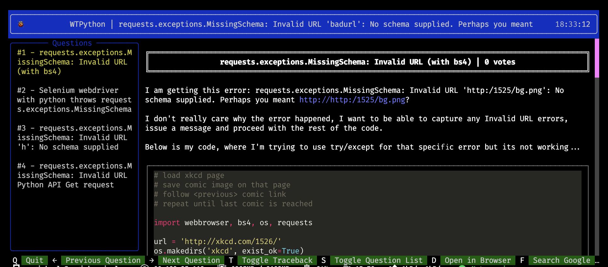

# What The Python?!

Helping you find answers to the errors Python spits out.

## Installation

You can find the source code on GitHub at: https://github.com/what-the-python/wtpython

To install directly please run:
```
pip install wtpython
```
## Usage

When you are running a python script, you might eventually come across an error like so.

```
$ python example/runs_with_error.py
0
1
2
Traceback (most recent call last):
  File "/home/cohan/github/perceptive-porcupines/Perceptive-Porcupines-Code-Jam-8/example/runs_with_error.py", line 8, in <module>
    requests.get('badurl')
  File "/home/cohan/github/perceptive-porcupines/Perceptive-Porcupines-Code-Jam-8/.venv/lib/python3.9/site-packages/requests/api.py", line 76, in get
    return request('get', url, params=params, **kwargs)
  File "/home/cohan/github/perceptive-porcupines/Perceptive-Porcupines-Code-Jam-8/.venv/lib/python3.9/site-packages/requests/api.py", line 61, in request
    return session.request(method=method, url=url, **kwargs)
  File "/home/cohan/github/perceptive-porcupines/Perceptive-Porcupines-Code-Jam-8/.venv/lib/python3.9/site-packages/requests/sessions.py", line 528, in request
    prep = self.prepare_request(req)
  File "/home/cohan/github/perceptive-porcupines/Perceptive-Porcupines-Code-Jam-8/.venv/lib/python3.9/site-packages/requests/sessions.py", line 456, in prepare_request
    p.prepare(
  File "/home/cohan/github/perceptive-porcupines/Perceptive-Porcupines-Code-Jam-8/.venv/lib/python3.9/site-packages/requests/models.py", line 316, in prepare
    self.prepare_url(url, params)
  File "/home/cohan/github/perceptive-porcupines/Perceptive-Porcupines-Code-Jam-8/.venv/lib/python3.9/site-packages/requests/models.py", line 390, in prepare_url
    raise MissingSchema(error)
requests.exceptions.MissingSchema: Invalid URL 'badurl': No schema supplied. Perhaps you meant http://badurl?
```

In this case, simply replace `python` with `wtpython` and you will see the error message line as well as what installed packages were part of the stack trace.

```
$ wtpython example/runs_with_error.py
```

This will bring up something like below, the color scheme might be different based off how your terminal is setup.



## Development Tools

- [Rich](https://rich.readthedocs.io/en/stable/) is a library to create styled text to the terminal. We'll use it for styling and formatting text.
- [Textual](https://github.com/willmcgugan/textual) is a part of rich to further aid in TUI design. We'll use it to create widgets and adjust the change the layout of the TUI.
- [Flit](https://flit.readthedocs.io/en/latest/) is a simple way to develop Python packages. It's pretty lightweight but can do a lot. We'll use it to manage dependencies.
- [pre-commit](https://pre-commit.com/) will run a few tests before you can commit your code. Don't worry, it will make the changes for you. Worst case, you'll have to type the `git add/commit` lines twice.


## Contribution instructions

To setup the system for development please fork the repository and do the below before submitting a pull request.
### Create and activate a virtual environment
```
python -m venv .venv --prompt template
source .venv/bin/activate
```

### Upgrade pip and install flit manually
```
python -m pip install -U pip flit
```

### Install the package using symlinks

Run this command to install the package in your virtual environment. If you add dependencies to `pyproject.toml`, you'll have to run this command again to install the new dependencies. Make sure to pin the version in `pyproject.toml`.


```
flit install -s
```

### Install pre-commit
The `.pre-commit-config.yaml` file is configured to perform the following tasks on each commit:

- Validate yaml files
- Validate toml files
- Ensure a single new line on each file
- Ensure trailing white spaces are removed
- Format your code with black
- Ensure your python imports are sorted consistently

```
pre-commit install
```
